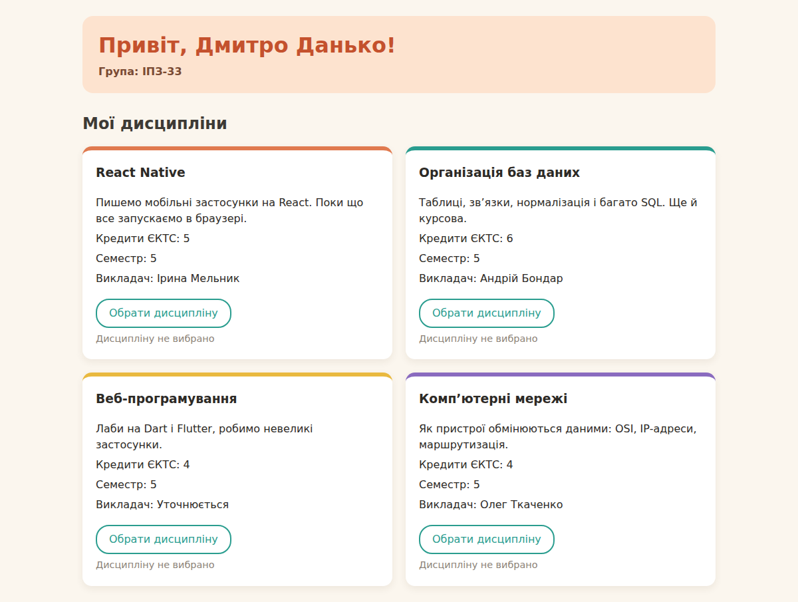
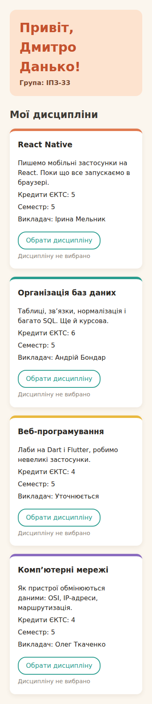
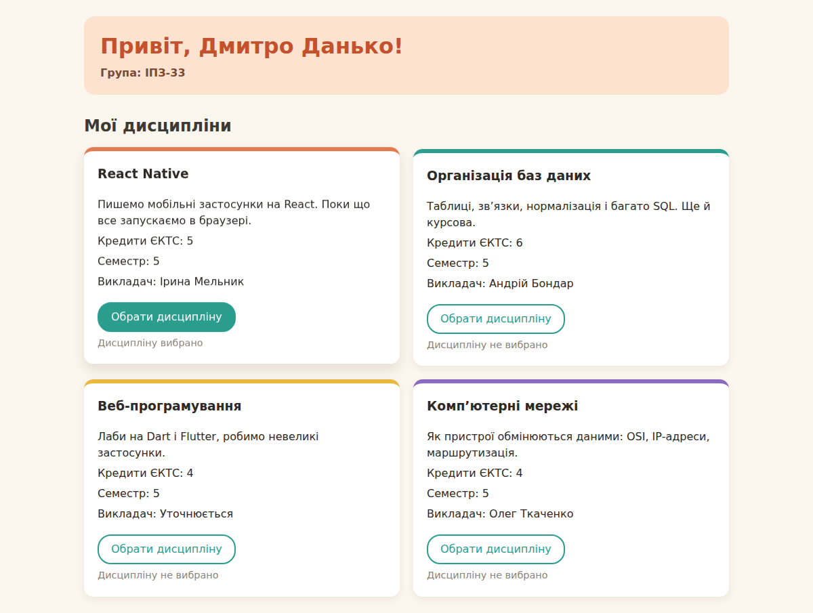

# Лабораторна робота 3. Основи React

**Виконав:** Дмитро Данько, група ІПЗ-33

**Мета:** навчитися створювати React-застосунок на TypeScript, розділяти сторінку на компоненти, імпортувати й експортувати їх, передавати дані через props та оформлювати інтерфейс за допомогою CSS.

## Запуск

```bash
npm install
npm run dev
```

## Завдання 2 — компонент в окремому файлі

`src/components/Heading.tsx`:

```tsx
export default function Heading() {
    return <h1>Привіт, Дмитро Данько! Група ІПЗ-33</h1>;
}
```

`src/App.tsx`:

```tsx
import Heading from './components/Heading';

export default function App() {
    return (
        <main className="page">
            <Heading />
        </main>
    );
}
```

## Остаточний код

`src/App.tsx`:

```tsx
import Heading from './components/Heading';
import Subject from './components/Subject';

export default function App() {
    return (
        <main className="page">
            <Heading firstName="Дмитро" lastName="Данько" group="ІПЗ-33" />

            <section aria-labelledby="subjects-title">
                <h2 id="subjects-title">Мої дисципліни</h2>

                <div className="subjects">
                    <Subject
                        subjectName="React Native"
                        description="Пишемо мобільні застосунки на React. Поки що все запускаємо в браузері."
                        credits={5}
                        semester={5}
                        teacher="Ірина Мельник"
                    />
                    <Subject
                        subjectName="Організація баз даних"
                        description="Таблиці, зв’язки, нормалізація і багато SQL. Ще й курсова."
                        credits={6}
                        semester={5}
                        teacher="Андрій Бондар"
                    />
                    <Subject
                        subjectName="Веб-програмування"
                        description="Лаби на Dart і Flutter, робимо невеликі застосунки."
                        credits={4}
                        semester={5}
                    />
                    <Subject
                        subjectName="Комп’ютерні мережі"
                        description="Як пристрої обмінюються даними: OSI, IP-адреси, маршрутизація."
                        credits={4}
                        semester={5}
                        teacher="Олег Ткаченко"
                    />
                </div>
            </section>
        </main>
    );
}
```

`src/components/Heading.tsx`:

```tsx
type HeadingProps = {
    firstName: string;
    lastName: string;
    group: string;
};

export default function Heading({ firstName, lastName, group }: HeadingProps) {
    return (
        <header className="page-header">
            <h1>Привіт, {firstName} {lastName}!</h1>
            <p>Група: {group}</p>
        </header>
    );
}
```

`src/components/Subject.tsx`:

```tsx
import { useState } from 'react';

type SubjectProps = {
    subjectName: string;
    description: string;
    credits: number;
    semester: number;
    teacher?: string;
};

export default function Subject({
    subjectName,
    description,
    credits,
    semester,
    teacher,
}: SubjectProps) {
    const [isSelected, setIsSelected] = useState(false);

    function handleToggle() {
        setIsSelected(current => !current);
    }

    return (
        <article className="subject">
            <h3>{subjectName}</h3>
            <p>{description}</p>
            <p>Кредити ЄКТС: {credits}</p>
            <p>Семестр: {semester}</p>
            <p>Викладач: {teacher ?? 'Уточнюється'}</p>

            <button
                type="button"
                className="select-button"
                onClick={handleToggle}
                aria-pressed={isSelected}
            >
                Обрати дисципліну
            </button>
            <p role="status">
                {isSelected ? 'Дисципліну вибрано' : 'Дисципліну не вибрано'}
            </p>
        </article>
    );
}
```

`src/index.css`:

```css
:root {
    font-family: 'Segoe UI', system-ui, sans-serif;
    line-height: 1.5;
    color: #2d2a26;
    background-color: #fbf6ee;
}

* {
    box-sizing: border-box;
}

body {
    margin: 0;
}

.page {
    max-width: 1000px;
    margin: 0 auto;
    padding: 24px;
}

h1 {
    color: #c4512d;
}

.page-header {
    margin-bottom: 28px;
    padding: 20px 24px;
    border-radius: 16px;
    background-color: #fde3cf;
}

.page-header h1 {
    margin: 0 0 4px;
    font-size: 2rem;
}

.page-header p {
    margin: 0;
    font-weight: 600;
    color: #7a4a33;
}

h2 {
    margin-bottom: 16px;
    color: #3d3a35;
}

.subjects {
    display: grid;
    grid-template-columns: 1fr;
    gap: 20px;
}

.subject {
    min-width: 0;
    padding: 20px;
    border-top: 6px solid #e07a4f;
    border-radius: 14px;
    background-color: #ffffff;
    box-shadow: 0 4px 12px rgba(80, 50, 20, 0.08);
    overflow-wrap: anywhere;
    transition: transform 0.2s, box-shadow 0.2s;
}

.subject:hover {
    transform: translateY(-4px);
    box-shadow: 0 10px 20px rgba(80, 50, 20, 0.14);
}

.subject:nth-child(2) {
    border-top-color: #2a9d8f;
}

.subject:nth-child(3) {
    border-top-color: #e9b93f;
}

.subject:nth-child(4) {
    border-top-color: #8a6bbf;
}

.subject h3 {
    margin-top: 0;
    color: #2d2a26;
}

.subject p {
    margin: 6px 0;
}

.subject p:last-child {
    margin-bottom: 0;
    font-size: 0.9rem;
    color: #8c8378;
}

@media (min-width: 700px) {
    .subjects {
        grid-template-columns: repeat(2, minmax(0, 1fr));
    }
}

.select-button {
    margin-top: 12px;
    padding: 8px 18px;
    border: 2px solid #2a9d8f;
    border-radius: 20px;
    font: inherit;
    color: #2a9d8f;
    background: #ffffff;
    cursor: pointer;
}

.select-button:hover {
    background: #e6f5f3;
}

.select-button[aria-pressed="true"] {
    color: #ffffff;
    background: #2a9d8f;
}

.select-button:focus-visible {
    outline: 3px solid #c4512d;
    outline-offset: 3px;
}
```

## Скріншоти

Широкий екран:



Вузький екран (375 px):



Додаткове завдання — вибрана дисципліна:



## Перевірка типів і збірка

```text
> lab3@0.0.0 build
> tsc -b && vite build
vite v8.3.1 building client environment for production...
transforming...
✓ 18 modules transformed.
rendering chunks...
computing gzip size...
dist/index.html                   0.47 kB │ gzip:  0.33 kB
dist/assets/index-DEXsbFCJ.css    0.95 kB │ gzip:  0.49 kB
dist/assets/index-BfCe1Z51.js   221.74 kB │ gzip: 69.66 kB
✓ built in 323ms

```

`npm run lint` теж пройшов без помилок.

## Пояснення

У `Heading` через props передаються ім'я, прізвище та група, а в `Subject` — назва дисципліни, опис, кількість кредитів, семестр і викладач. Дані задаються в `App`, а компоненти лише їх показують, тобто дані йдуть від батьківського компонента до дочірнього.

Поле `teacher` необов'язкове (`teacher?: string`). Для «Веб-програмування» я його не передав, і через `??` там виводиться «Уточнюється».

TypeScript допоміг, коли я перевіряв помилки: при `firstName={123}` у панелі Problems з'явилась помилка, що `number` не можна присвоїти `string`. Коли я прибрав `group`, він показав, що бракує обов'язкової властивості. А після додавання `semester: number` у тип підкреслились усі `<Subject />`, де семестру ще не було, тому я нічого не пропустив.

**Додаткове завдання.** У `Subject` є стан `isSelected` через `useState(false)`. Кнопка викликає `handleToggle`, який перемикає значення на протилежне. Кожна картка — окремий екземпляр компонента, тому в кожної свій стан, і вибір однієї не впливає на інші. Після перезавантаження сторінки стан скидається, бо він ніде не зберігається.

## Висновок

У цій роботі я створив React-застосунок на TypeScript через Vite, розбив сторінку на компоненти `Heading` і `Subject`, виніс їх в окремі файли та підключив через `import`/`export`. Навчився передавати дані через типізовані props, робити необов'язкові поля і підставляти значення за замовчуванням через `??`. Оформив картки через CSS Grid так, щоб на вузькому екрані вони ставали в одну колонку. Також спробував локальний стан через `useState` і обробку натискання кнопки.
